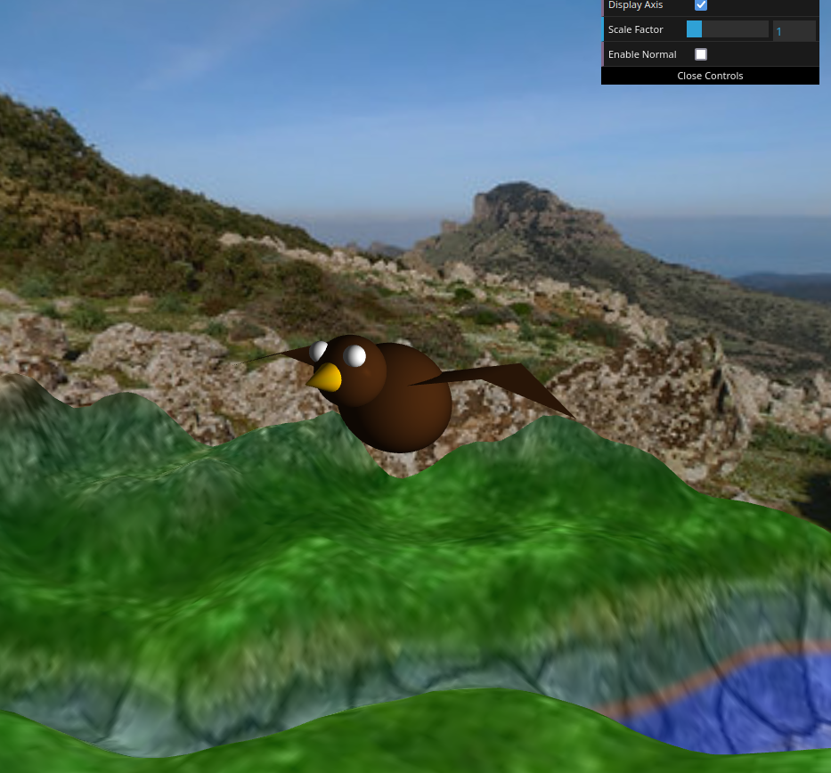
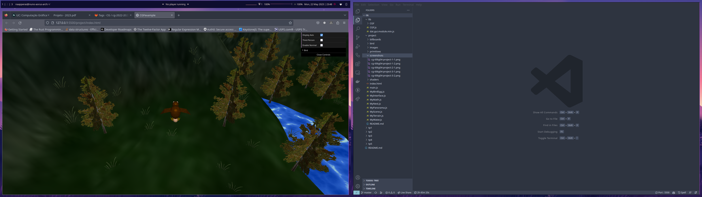
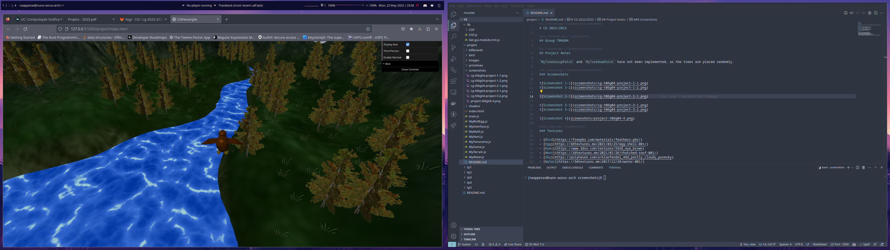

# CG 2022/2023

## Group T06G04

## Project Notes

`MyTreeGroupPatch` and `MyTreeRowPatch` have not been implemented, as the trees are placed randomly.

### Screenshots

### Textures

- [Bird](https://freepbr.com/materials/feathers-pbr/)
- [Egg](https://3dtextures.me/2021/03/25/egg-shell-001/)
- [Eyes](https://www.3dxo.com/textures/5928_eye_brown)
- [Nest](https://3dtextures.me/2021/01/26/thatched-roof-001/)
- [Sky](https://polyhaven.com/a/kloofendal_48d_partly_cloudy_puresky)
- [Water](https://3dtextures.me/2017/12/28/water-001/)
- [Grass](https://opengameart.org/content/64-billboard-grass-texture-and-mesh-ngrassdiff001png)
